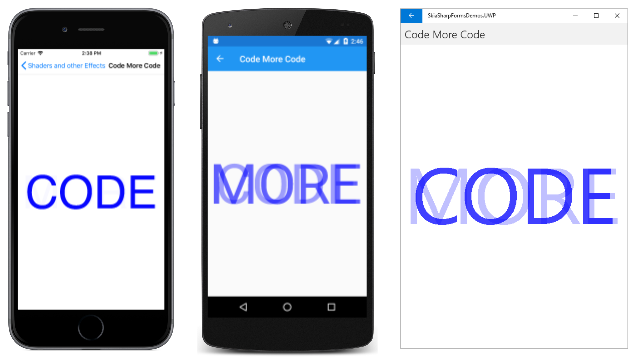
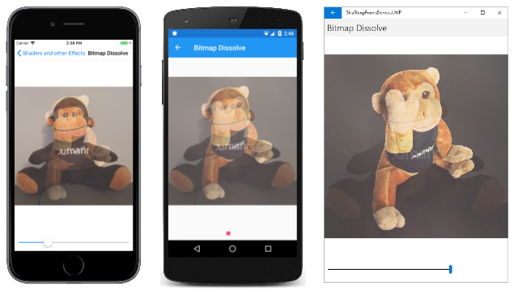

# SkiaSharp transparency

As you've seen, the [`SKPaint`](xref:SkiaSharp.SKPaint) class includes a [`Color`](xref:SkiaSharp.SKPaint.Color) property of type [`SKColor`](xref:SkiaSharp.SKColor). `SKColor` includes an alpha channel, so anything that you color with an `SKColor` value can be partially transparent.

Some transparency was demonstrated in the [**Basic Animation in SkiaSharp**](animation.md) article. This article goes somewhat deeper into transparency to combine multiple objects in a single scene, a technique sometimes known as _blending_. More advanced blending techniques are discussed in the articles in the [**SkiaSharp shaders**](../effects/shaders/index.md) section.

You can set the transparency level when you first create a color using the four-parameter [`SKColor`](xref:SkiaSharp.SKColor.%23ctor(System.Byte,System.Byte,System.Byte,System.Byte)) constructor:

```csharp
SKColor (byte red, byte green, byte blue, byte alpha);
```

An alpha value of 0 is fully transparent and an alpha value of 0xFF is fully opaque. Values between those two extremes create colors that are partially transparent.

In addition, `SKColor` defines a handy [`WithAlpha`](xref:SkiaSharp.SKColor.WithAlpha*) method that creates a new color from an existing color but with the specified alpha level:

```csharp
SKColor halfTransparentBlue = SKColors.Blue.WithAlpha(0x80);
```

The use of partially transparent text is demonstrated in the **Code More Code** page in the sample. This page fades two text strings in and out by incorporating transparency in the `SKColor` values:

```csharp
public class CodeMoreCodePage : ContentPage
{
    SKCanvasView canvasView;
    bool isAnimating;
    Stopwatch stopwatch = new Stopwatch();
    double transparency;

    public CodeMoreCodePage ()
    {
        Title = "Code More Code";

        canvasView = new SKCanvasView();
        canvasView.PaintSurface += OnCanvasViewPaintSurface;
        Content = canvasView;
    }

    protected override void OnAppearing()
    {
        base.OnAppearing();

        isAnimating = true;
        stopwatch.Start();
        Device.StartTimer(TimeSpan.FromMilliseconds(16), OnTimerTick);
    }

    protected override void OnDisappearing()
    {
        base.OnDisappearing();

        stopwatch.Stop();
        isAnimating = false;
    }

    bool OnTimerTick()
    {
        const int duration = 5;     // seconds
        double progress = stopwatch.Elapsed.TotalSeconds % duration / duration;
        transparency = 0.5 * (1 + Math.Sin(progress * 2 * Math.PI));
        canvasView.InvalidateSurface();

        return isAnimating;
    }

    void OnCanvasViewPaintSurface(object sender, SKPaintSurfaceEventArgs args)
    {
        SKImageInfo info = args.Info;
        SKSurface surface = args.Surface;
        SKCanvas canvas = surface.Canvas;

        canvas.Clear();

        const string TEXT1 = "CODE";
        const string TEXT2 = "MORE";

        using (SKPaint paint = new SKPaint())
        {
            // Set text width to fit in width of canvas
            paint.TextSize = 100;
            float textWidth = paint.MeasureText(TEXT1);
            paint.TextSize *= 0.9f * info.Width / textWidth;

            // Center first text string
            SKRect textBounds = new SKRect();
            paint.MeasureText(TEXT1, ref textBounds);

            float xText = info.Width / 2 - textBounds.MidX;
            float yText = info.Height / 2 - textBounds.MidY;

            paint.Color = SKColors.Blue.WithAlpha((byte)(0xFF * (1 - transparency)));
            canvas.DrawText(TEXT1, xText, yText, paint);

            // Center second text string
            textBounds = new SKRect();
            paint.MeasureText(TEXT2, ref textBounds);

            xText = info.Width / 2 - textBounds.MidX;
            yText = info.Height / 2 - textBounds.MidY;

            paint.Color = SKColors.Blue.WithAlpha((byte)(0xFF * transparency));
            canvas.DrawText(TEXT2, xText, yText, paint);
        }
    }
}
```

The `transparency` field is animated to vary from 0 to 1 and back again in a sinusoidal rhythm. The first text string is displayed with an alpha value calculated by subtracting the `transparency` value from 1:

```csharp
paint.Color = SKColors.Blue.WithAlpha((byte)(0xFF * (1 - transparency)));
```

The [`WithAlpha`](xref:SkiaSharp.SKColor.WithAlpha*) method sets the alpha component on an existing color, which here is `SKColors.Blue`. The second text string uses an alpha value calculated from the `transparency` value itself:

```csharp
paint.Color = SKColors.Blue.WithAlpha((byte)(0xFF * transparency));
```

The animation alternates between the two words, urging the user to "code more" (or perhaps requesting "more code"):

[](transparency-images/CodeMoreCode-Large.png#lightbox)

In the previous article on [**Bitmap Basics in SkiaSharp**](bitmaps.md), you saw how to display bitmaps using one of the [`DrawBitmap`](xref:SkiaSharp.SKCanvas.DrawBitmap*) methods of `SKCanvas`. All the `DrawBitmap` methods include an `SKPaint` object as the last parameter. By default, this parameter is set to `null` and you can ignore it.

Alternatively, you can set the `Color` property of this `SKPaint` object to display a bitmap with some level of transparency. Setting a level of transparency in the `Color` property of `SKPaint` allows you to fade bitmaps in and out, or to dissolve one bitmap into another.

Bitmap transparency is demonstrated in the **Bitmap Dissolve** page. The XAML file instantiates an `SKCanvasView` and a `Slider`:

```xaml
<ContentPage xmlns="http://xamarin.com/schemas/2014/forms"
             xmlns:x="http://schemas.microsoft.com/winfx/2009/xaml"
             xmlns:skia="clr-namespace:SkiaSharp.Views.Forms;assembly=SkiaSharp.Views.Forms"
             x:Class="SkiaSharpFormsDemos.Effects.BitmapDissolvePage"
             Title="Bitmap Dissolve">
    <StackLayout>
        <skia:SKCanvasView x:Name="canvasView"
                           VerticalOptions="FillAndExpand"
                           PaintSurface="OnCanvasViewPaintSurface" />

        <Slider x:Name="progressSlider"
                Margin="10"
                ValueChanged="OnSliderValueChanged" />
    </StackLayout>
</ContentPage>
```

The code-behind file loads two bitmap resources. These bitmaps are not the same size, but they are the same aspect ratio:

```csharp
public partial class BitmapDissolvePage : ContentPage
{
    SKBitmap bitmap1;
    SKBitmap bitmap2;

    public BitmapDissolvePage()
    {
        InitializeComponent();

        // Load two bitmaps
        Assembly assembly = GetType().GetTypeInfo().Assembly;

        using (Stream stream = assembly.GetManifestResourceStream(
                                "SkiaSharpFormsDemos.Media.SeatedMonkey.jpg"))
        {
            bitmap1 = SKBitmap.Decode(stream);
        }
        using (Stream stream = assembly.GetManifestResourceStream(
                                "SkiaSharpFormsDemos.Media.FacePalm.jpg"))
        {
            bitmap2 = SKBitmap.Decode(stream);
        }
    }

    void OnSliderValueChanged(object sender, ValueChangedEventArgs args)
    {
        canvasView.InvalidateSurface();
    }

    void OnCanvasViewPaintSurface(object sender, SKPaintSurfaceEventArgs args)
    {
        SKImageInfo info = args.Info;
        SKSurface surface = args.Surface;
        SKCanvas canvas = surface.Canvas;

        canvas.Clear();

        // Find rectangle to fit bitmap
        float scale = Math.Min((float)info.Width / bitmap1.Width,
                                (float)info.Height / bitmap1.Height);
        SKRect rect = SKRect.Create(scale * bitmap1.Width,
                                    scale * bitmap1.Height);
        float x = (info.Width - rect.Width) / 2;
        float y = (info.Height - rect.Height) / 2;
        rect.Offset(x, y);

        // Get progress value from Slider
        float progress = (float)progressSlider.Value;

        // Display two bitmaps with transparency
        using (SKPaint paint = new SKPaint())
        {
            paint.Color = paint.Color.WithAlpha((byte)(0xFF * (1 - progress)));
            canvas.DrawBitmap(bitmap1, rect, paint);

            paint.Color = paint.Color.WithAlpha((byte)(0xFF * progress));
            canvas.DrawBitmap(bitmap2, rect, paint);
        }
    }
}
```

The `Color` property of the `SKPaint` object is set to two complementary alpha levels for the two bitmaps. When using `SKPaint` with bitmaps, it doesn't matter what the rest of the `Color` value is. All that matters is the alpha channel. The code here simply calls the `WithAlpha` method on the default value of the `Color` property.

Moving the `Slider` dissolves between one bitmap and the other:

[](transparency-images/BitmapDissolve-Large.png#lightbox)

In the past several articles, you have seen how to use SkiaSharp to draw text, circles, ellipses, rounded rectangles, and bitmaps. The next step is [SkiaSharp Lines and Paths](../paths/index.md) in which you will learn how to draw connected lines in a graphics path.

## Related links

- [SkiaSharp APIs](/dotnet/api/skiasharp)
